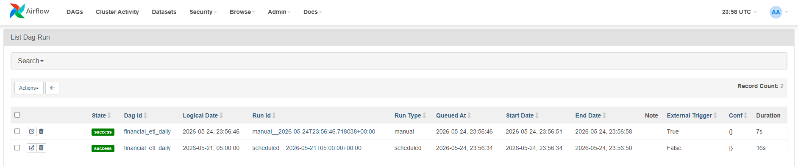

# Financial Markets ETL Pipeline

A portfolio project demonstrating data engineering skills applied to financial market data. Extracts price and macroeconomic data from public APIs, computes technical indicators, and loads everything into a PostgreSQL database. Orchestrated with Apache Airflow via Docker Compose.

---

## Architecture

The pipeline can run in two modes:

**CLI mode** — run manually with `python -m src.pipeline`, connects to a local PostgreSQL instance.

**Airflow mode** — orchestrated via Docker Compose. All services (Airflow + PostgreSQL) run inside containers — no local database setup needed.

```
┌──────────────────────────────────────────────────────────────────────┐
│                        Docker Compose                                │
│                                                                      │
│  ┌─────────────┐   ┌──────────────────┐   ┌──────────────────────┐  │
│  │   EXTRACT   │   │    TRANSFORM     │   │        LOAD          │  │
│  │             │   │                  │   │                      │  │
│  │  yfinance   │──▶│  Clean nulls     │──▶│  Upsert to           │  │
│  │  FRED API   │   │  Calc returns    │   │  PostgreSQL          │  │
│  │             │   │  Technical ind.  │   │  (Docker container)  │  │
│  └─────────────┘   └──────────────────┘   └──────────┬───────────┘  │
│        │                    │                         │              │
│    extract.py         transform.py               load.py            │
│                                                      │              │
│  ┌────────────────────┐                ┌─────────────┴────────────┐ │
│  │  Airflow Scheduler │                │  PostgreSQL (financial_  │ │
│  │  + Webserver (UI)  │                │  etl) — port 5433        │ │
│  │  port 8080         │                └──────────────────────────┘ │
│  └────────────────────┘                                             │
└──────────────────────────────────────────────────────────────────────┘
```

---

## Tech Stack

| Layer | Tool |
|---|---|
| Orchestration | Apache Airflow (Docker Compose) |
| Extraction | `yfinance`, `fredapi` |
| Transformation | `pandas`, `numpy` |
| Loading | `psycopg2` |
| Database | PostgreSQL |
| Testing | `pytest`, `unittest.mock` |

---

## Data Sources

### Yahoo Finance (`yfinance`)
- Daily OHLCV prices for stocks, indices, ETFs, FX pairs, commodities
- No API key required
- Example tickers: `AAPL`, `MSFT`, `^GSPC`, `^VIX`, `GC=F`, `EURUSD=X`

### FRED — Federal Reserve Economic Data (`fredapi`)
- Macroeconomic indicators from the US Federal Reserve
- Free API key required: [fred.stlouisfed.org](https://fred.stlouisfed.org/docs/api/api_key.html)
- Series tracked: `GDP`, `CPIAUCSL`, `UNRATE`, `DFF`, `T10Y2Y`

---

## Database Schema

Four tables in the `financial_etl` PostgreSQL database:

| Table | Description |
|---|---|
| `assets` | Master list of tracked instruments |
| `daily_prices` | Historical OHLCV data per asset per day |
| `technical_indicators` | Computed indicators per asset per day |
| `macro_indicators` | FRED macro series values |

All writes use `INSERT ... ON CONFLICT DO UPDATE` — the pipeline is fully idempotent.

---

## Project Structure

```
financial-etl/
├── README.md
├── PROJECT_PLAN.md
├── CLAUDE.md                  # AI session context
├── requirements.txt
├── .env                       # DB credentials + FRED key (never commit)
├── .gitignore
│
├── config/
│   └── settings.py            # Loads .env, defines tickers/series/lookback
│
├── src/
│   ├── __init__.py
│   ├── extract.py             # yfinance + FRED API calls
│   ├── transform.py           # Data cleaning + indicator calculations
│   ├── load.py                # PostgreSQL upserts
│   └── pipeline.py            # Orchestrator + CLI
│
├── sql/
│   └── schema.sql             # CREATE TABLE statements + indexes
│
└── tests/
    ├── test_extract.py        # Mocked API tests
    └── test_transform.py      # Unit tests for cleaning + indicators
```

---

## Setup

There are two ways to run this project:

### Option A — CLI mode (local PostgreSQL)

For running the pipeline manually with `python -m src.pipeline`.

**1. PostgreSQL** — install and create the database:
```bash
psql -U postgres -c "CREATE DATABASE financial_etl;"
psql -U postgres -d financial_etl -f sql/schema.sql
```

**2. Python dependencies:**
```bash
pip install yfinance fredapi pandas psycopg2-binary python-dotenv pytest
```

**3. Environment variables** — create a `.env` file in the project root:
```
DB_HOST=localhost
DB_PORT=5432
DB_NAME=financial_etl
DB_USER=postgres
DB_PASSWORD=your_password

FRED_API_KEY=your_fred_api_key
```

### Option B — Airflow mode (Docker, no local PostgreSQL needed)

For running the pipeline on a schedule with the Airflow UI. Docker Compose handles everything — PostgreSQL runs inside a container.

**1. Install Docker Desktop** (or use GitHub Codespaces, which has Docker built in).

**2. Environment variables** — create a `.env` file:
```
DB_PASSWORD=postgres
FRED_API_KEY=your_fred_api_key
```

**3. Start Airflow** — see the "Running with Airflow" section below.

Get a free FRED API key at [fred.stlouisfed.org](https://fred.stlouisfed.org/docs/api/api_key.html).

---

## Running the Pipeline

```bash
# Full 2-year backfill for all tickers
python -m src.pipeline --mode backfill

# Last 5 days only (for daily scheduled runs)
python -m src.pipeline --mode daily

# Override tickers
python -m src.pipeline --mode backfill --tickers AAPL,MSFT

# Skip FRED macro extraction
python -m src.pipeline --mode backfill --skip-macro
```

---

## Running with Airflow (Docker)

The pipeline is also orchestrated as an Airflow DAG with Docker Compose.

### Start Airflow

```bash
# Create .env with your credentials (see Environment Variables section above)
docker compose up airflow-init
docker compose up -d
```

### Access the Airflow UI

Open [http://localhost:8080](http://localhost:8080) — login: `airflow` / `airflow`

### Trigger a run

1. Find `financial_etl_daily` in the DAGs list
2. Toggle the switch to unpause
3. Click the play button to trigger manually

### DAG task graph

```
extract_prices  →  transform_prices  →  load_prices
extract_macro   →  load_macro
```

Schedule: weekdays at 07:00 CET (`0 5 * * 1-5` UTC)

### Stop Airflow

```bash
docker compose down      # stop containers
docker compose down -v   # stop and delete all data
```

---

## Running Tests

```bash
python -m pytest tests/ -v
```

29 tests — no real API calls (all mocked). Covers:
- Data cleaning edge cases (nulls, zeros, duplicates)
- Indicator math correctness (returns, SMA, EMA, RSI, volatility)
- API retry logic
- Empty DataFrame handling

---

## Indicators Computed

| Indicator | Formula |
|---|---|
| `daily_return` | `(close - prev_close) / prev_close` |
| `sma_20` | 20-day simple moving average of close |
| `sma_50` | 50-day simple moving average of close |
| `ema_12` | 12-day exponential moving average |
| `ema_26` | 26-day exponential moving average |
| `rsi_14` | 14-day Wilder's RSI |
| `volatility_30` | 30-day rolling std dev of daily returns |

---

## Useful Queries

```sql
-- Row counts across all tables
SELECT 'assets' AS tbl, COUNT(*) FROM assets
UNION ALL SELECT 'daily_prices', COUNT(*) FROM daily_prices
UNION ALL SELECT 'technical_indicators', COUNT(*) FROM technical_indicators
UNION ALL SELECT 'macro_indicators', COUNT(*) FROM macro_indicators;

-- Latest prices for all assets
SELECT a.ticker, p.date, p.close, p.volume
FROM daily_prices p
JOIN assets a ON a.asset_id = p.asset_id
WHERE p.date = (SELECT MAX(date) FROM daily_prices)
ORDER BY a.ticker;

-- RSI signals (overbought / oversold)
SELECT a.ticker, ROUND(t.rsi_14, 2) AS rsi,
    CASE WHEN t.rsi_14 > 70 THEN 'Overbought'
         WHEN t.rsi_14 < 30 THEN 'Oversold'
         ELSE 'Neutral' END AS signal
FROM technical_indicators t
JOIN assets a ON a.asset_id = t.asset_id
WHERE t.date = (SELECT MAX(date) FROM technical_indicators);

-- Latest macro values
SELECT indicator_code, indicator_name, date, value
FROM macro_indicators
WHERE (indicator_code, date) IN (
    SELECT indicator_code, MAX(date)
    FROM macro_indicators GROUP BY indicator_code
)
ORDER BY indicator_code;
```

---

## Sample Output

**Row counts after full backfill**


**All tracked assets across 3 asset classes**


**RSI signals and moving averages — latest date across all tickers**


**Latest macro indicator values from FRED**


**Airflow DAG — overview with successful runs**


**Airflow DAG — run history (manual + scheduled)**


---

## Design Decisions

**Why upserts?** Plain `INSERT` fails on re-runs. `ON CONFLICT DO UPDATE` makes the pipeline idempotent — safe to run multiple times with the same result.

**Why `NUMERIC` instead of `FLOAT`?** Financial data requires precision. `FLOAT` introduces rounding errors. `NUMERIC(14,4)` stores exact decimal values.

**Why separate tables for indicators?** Raw prices and derived data are kept apart. If the RSI formula changes, just re-run the transform — raw data stays intact.

**Why mock the API in tests?** Tests run in ~1 second without network calls, never fail due to API downtime, and always return deterministic data.
